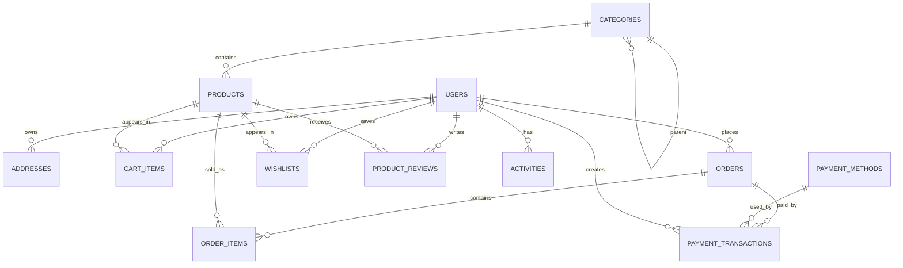

# GlowCandles


GlowCandles is a Laravel-based ecommerce web application for selling candle products. It includes a public storefront, customer authentication, cart and checkout flows, wishlist management, customer profile and address management, order records, editable content pages, contact submissions, and a Filament admin panel for managing store data.

## Table of Contents

- [Overview](#overview)
- [Key Features](#key-features)
- [Technology and Version Information](#technology-and-version-information)
- [Technology Stack](#technology-stack)
- [Project Architecture](#project-architecture)
- [Project Directory Structure](#project-directory-structure)
- [Database Documentation](#database-documentation)
- [Authentication and Authorization](#authentication-and-authorization)
- [Routes and API Documentation](#routes-and-api-documentation)
- [Admin Panel](#admin-panel)
- [Installation and Setup](#installation-and-setup)
- [Configuration](#configuration)
- [Environment Variables](#environment-variables)
- [Database Migration and Seeding](#database-migration-and-seeding)
- [Testing](#testing)
- [Code Quality and Development Standards](#code-quality-and-development-standards)
- [Build and Production](#build-and-production)
- [Deployment](#deployment)
- [Security](#security)
- [External Services and Integrations](#external-services-and-integrations)
- [Scheduled Tasks and Queues](#scheduled-tasks-and-queues)
- [Storage and File Management](#storage-and-file-management)
- [Logging and Error Handling](#logging-and-error-handling)
- [Troubleshooting](#troubleshooting)
- [Frequently Asked Questions](#frequently-asked-questions)
- [Version Information](#version-information)
- [Changelog](#changelog)
- [License](#license)
- [Credits and Author](#credits-and-author)
- [Project Status](#project-status)

## Overview

GlowCandles is a monolithic Laravel application that renders a Blade/Tailwind storefront and uses Laravel controllers, Eloquent models, migrations, policies, services, and Filament resources for backend functionality.

The application is intended for an online candle store. Its implementation supports browsing products and categories, viewing dynamic content pages, submitting contact requests, creating customer accounts, managing carts and wishlists, checking out with saved addresses, and administering ecommerce data through Filament.

Confirmed project type: Laravel ecommerce web application with server-rendered frontend and admin panel.

## Key Features

### Storefront Features

- Homepage with featured products, new arrivals, categories, best sellers, and store statistics.
- Product catalog with category filtering, keyword search, sorting, pagination, featured products, ratings, and wishlist state.
- Product detail pages with gallery handling, related products, average rating, review count, pricing, stock/SKU display, and wishlist state.
- Category listing and category detail pages.
- Public content pages for About, Contact, Privacy Policy, and Shipping Policy.
- Contact form with persisted contact submissions.
- Custom 404 error view.

### Customer Features

- Registration, login, logout, email verification, password confirmation, password reset, and password update.
- Customer profile edit and account deletion.
- Address management with create, update, delete, and default address support.
- Shopping cart for authenticated users through `cart_items` and guest cart support through session data.
- Wishlist add, remove, list, and move-to-cart actions.
- Checkout flow requiring authentication, email verification, a saved address, and cart items.
- Customer order list route is implemented; detailed order display method is currently a placeholder.
- Activity logging for profile updates and order placement.

### Admin Features

- Filament admin panel mounted at `/admin`.
- Filament login enabled.
- Admin resources detected for products, categories, users, orders, order items, cart items, wishlists, addresses, product reviews, payment methods, payment transactions, activities, content pages, and contact submissions.
- Dashboard widgets for users/products/orders/revenue, sales overview, revenue by category, recent orders, and top selling products.

### API Features

- Sanctum-protected `/api/user` route.
- Payment API routes are declared in `routes/api.php`, but the referenced `App\Http\Controllers\PaymentController` file was not detected. These routes should be treated as incomplete until that controller exists.

## Technology and Version Information

Versions below are detected from `composer.lock`, `package-lock.json`, local runtime commands, or project constraints.

| Technology | Version | Purpose | Source |
| --- | --- | --- | --- |
| PHP | Project requires `^8.2`; local CLI detected `8.5.5` | Backend language/runtime | `composer.json`, `php -v` |
| Laravel Framework | `12.31.1` | Backend framework | `composer.lock` |
| Filament | `4.1.7` | Admin panel | `composer.lock` |
| Livewire | `3.6.4` | Filament/reactive UI dependency | `composer.lock` |
| Laravel Sanctum | `4.2.0` | API token authentication | `composer.lock` |
| Laravel Breeze | `2.3.8` | Authentication scaffolding | `composer.lock` |
| Laravel Pint | `1.25.1` | PHP code style tool | `composer.lock` |
| Laravel Sail | `1.46.0` | Docker development tooling dependency | `composer.lock` |
| Laravel Pail | `1.2.3` | Local log tailing | `composer.lock` |
| PHPUnit | `11.5.41` | Test runner | `composer.lock` |
| hardevine/shoppingcart | `3.4` | Cart package | `composer.lock` |
| Tighten Ziggy | `2.6.0` | Laravel route access from JavaScript | `composer.lock` |
| Node.js | Local CLI detected `24.15.0` | JavaScript runtime | `node -v` |
| npm | Local CLI detected `11.12.1` | JavaScript package manager | `npm.cmd -v` |
| Vite | `7.1.7` | Frontend build tool | `package-lock.json` |
| Laravel Vite Plugin | `2.0.1` | Laravel/Vite integration | `package-lock.json` |
| Tailwind CSS | `3.4.17` | Styling framework | `package-lock.json` |
| @tailwindcss/forms | `0.5.10` | Form styling plugin | `package-lock.json` |
| Alpine.js | `3.15.0` | Frontend interactivity | `package-lock.json` |
| Axios | `1.12.2` | HTTP client | `package-lock.json` |
| PostCSS | `8.5.6` | CSS processing | `package-lock.json` |
| Autoprefixer | `10.4.21` | CSS vendor prefixing | `package-lock.json` |
| concurrently | `9.2.1` | Runs development processes together | `package-lock.json` |
| Database engine | SQLite by default; MySQL, MariaDB, PostgreSQL, and SQL Server are configured options | Persistence | `.env.example`, `config/database.php` |

## Technology Stack

### Programming Languages

- PHP
- JavaScript
- Blade
- HTML
- CSS
- SQL through Laravel migrations and Eloquent

### Frameworks

- Laravel
- Filament
- Livewire
- Tailwind CSS
- Alpine.js

### Libraries and Packages

| Package | Version | Purpose |
| --- | --- | --- |
| `filament/filament` | `4.1.7` | Admin panel resources, dashboard, forms, tables, and widgets |
| `laravel/framework` | `12.31.1` | Application framework |
| `laravel/sanctum` | `4.2.0` | API token authentication and `/api/user` protection |
| `laravel/breeze` | `2.3.8` | Authentication scaffolding |
| `hardevine/shoppingcart` | `3.4` | Shopping cart package used by cart-related services/controllers |
| `tightenco/ziggy` | `2.6.0` | Laravel route helper integration for frontend code |
| `alpinejs` | `3.15.0` | Browser-side interactivity |
| `vite` | `7.1.7` | Frontend asset development and production builds |
| `tailwindcss` | `3.4.17` | Utility-first styling |
| `@tailwindcss/forms` | `0.5.10` | Form component styling |
| `axios` | `1.12.2` | JavaScript HTTP requests |
| `phpunit/phpunit` | `11.5.41` | Unit and feature tests |
| `laravel/pint` | `1.25.1` | PHP formatting |
| `laravel/pail` | `1.2.3` | Log tailing in the `composer dev` script |

### Database

- Default database connection: SQLite.
- Additional configured Laravel connections: MySQL, MariaDB, PostgreSQL, SQL Server, and Redis.
- Migration files exist under `database/migrations`.
- Seeder files exist under `database/seeders`.
- No `database/factories` directory was detected, although tests and `User` reference a `UserFactory`.

### Frontend

- Server-rendered Blade views in `resources/views`.
- Tailwind CSS entry point at `resources/css/app.css`.
- JavaScript entry point at `resources/js/app.js`.
- Cart-specific JavaScript in `resources/js/cart.js`.
- Alpine.js is initialized in `resources/js/app.js`.
- Vite builds `resources/css/app.css` and `resources/js/app.js`.

### Backend

- Laravel MVC structure.
- Controllers under `app/Http/Controllers`.
- Eloquent models under `app/Models`.
- Services under `app/Services`.
- Policies under `app/Policies`.
- Providers under `app/Providers`.
- Routes under `routes/web.php`, `routes/auth.php`, `routes/api.php`, and `routes/console.php`.

## Project Architecture

```text
Browser
  |
  v
Blade views + Tailwind CSS + Alpine.js
  |
  v
Laravel web routes / API routes
  |
  v
Controllers
  |
  v
Services, Policies, Validation, Auth
  |
  v
Eloquent Models
  |
  v
Database tables and storage disks

Administrators
  |
  v
Filament panel at /admin
  |
  v
Filament resources, forms, tables, widgets
  |
  v
Eloquent Models
```

The storefront and customer workflows are handled by Laravel controllers and Blade templates. The admin interface is handled by Filament resources discovered from `app/Filament/Resources` and widgets discovered from `app/Filament/Widgets`.

## Project Directory Structure

```text
GlowCandles/
├── app/
│   ├── Filament/
│   │   ├── Resources/
│   │   └── Widgets/
│   ├── Http/
│   │   ├── Controllers/
│   │   ├── Middleware/
│   │   └── Requests/
│   ├── Models/
│   ├── Policies/
│   ├── Providers/
│   ├── Services/
│   └── View/
├── bootstrap/
├── config/
├── database/
│   ├── migrations/
│   └── seeders/
├── public/
│   ├── asset/
│   ├── build/
│   ├── css/
│   ├── fonts/
│   ├── images/
│   ├── js/
│   └── storage/
├── resources/
│   ├── css/
│   ├── js/
│   └── views/
├── routes/
│   └── api/
├── storage/
├── tests/
│   ├── Feature/
│   └── Unit/
├── composer.json
├── composer.lock
├── docker-compose.yml
├── package.json
├── package-lock.json
├── phpunit.xml
├── postcss.config.js
├── tailwind.config.js
└── vite.config.js
```

| Path | Purpose |
| --- | --- |
| `app/Filament/Resources` | Filament admin CRUD resources |
| `app/Filament/Widgets` | Filament dashboard widgets |
| `app/Http/Controllers` | Storefront, account, cart, checkout, content page, and file controllers |
| `app/Models` | Eloquent models for ecommerce and CMS entities |
| `app/Policies` | Authorization policies for addresses and categories |
| `app/Services` | Activity logging and cart restoration logic |
| `database/migrations` | Database schema definitions |
| `database/seeders` | Seed data for admin user and content pages |
| `resources/views` | Blade views for storefront, auth, checkout, cart, profile, orders, pages, and errors |
| `resources/js` | Frontend JavaScript entry points |
| `resources/css` | Tailwind CSS entry point |
| `routes` | Web, auth, API, and console route declarations |
| `tests` | PHPUnit unit and feature tests |

## Database Documentation

### Main Tables

| Table | Purpose | Important Fields |
| --- | --- | --- |
| `users` | Customer/admin accounts | `name`, `email`, `password`, personal details, billing/shipping fields, status flags, preferences, soft deletes |
| `personal_access_tokens` | Sanctum API tokens | `tokenable`, `name`, `token`, `abilities`, `last_used_at`, `expires_at` |
| `categories` | Product categories with hierarchy | `name`, `slug`, `parent_id`, `image`, SEO fields, `is_active`, `is_featured`, soft deletes |
| `products` | Store products | `name`, `slug`, `price`, `sku`, inventory fields, type/status, media, `category_id`, shipping fields, variant-like fields, flags, counters, soft deletes |
| `product_reviews` | Product reviews | `product_id`, `user_id`, `rating`, `title`, `comment`, moderation fields, helpfulness counters |
| `wishlists` | User wishlist items | `user_id`, `product_id`, `name`, `notes` |
| `cart_items` | Persisted carts | `cart_id`, `product_id`, `user_id`, `quantity`, `price`, `options`, `added_at` |
| `orders` | Customer orders | `user_id`, `order_number`, `status`, totals, payment fields, billing/shipping snapshot fields |
| `order_items` | Order line items | `order_id`, `product_id`, `name`, `price`, `quantity`, `options` |
| `addresses` | User saved addresses | `user_id`, `full_name`, `phone`, address fields, `is_default` |
| `payment_methods` | Payment options | `name`, `code`, `description`, `logo`, `config`, `is_active`, `sort_order` |
| `payment_transactions` | Payment transaction records | `order_id`, `user_id`, `payment_method_id`, `transaction_id`, `status`, `amount`, `currency`, UPI-related fields |
| `about_pages` | Editable About page content | Banner, section, mission, vision, team, SEO, active status |
| `privacy_policy_pages` | Editable Privacy Policy content | Policy sections, SEO, active status |
| `shipping_policy_pages` | Editable Shipping Policy content | Shipping sections, FAQ/contact sections, SEO, active status |
| `contact_pages` | Editable Contact page content | Contact details, social URLs, map embed, CTA, SEO, active status |
| `contact_submissions` | Submitted contact form messages | `name`, `email`, `phone`, `subject`, `message`, request metadata, `is_read` |
| `activities` | User activity log | `user_id`, `type`, `title`, `description`, `icon`, `color`, `metadata`, `read_at` |
| `cache`, `cache_locks` | Database cache tables | Cache keys, values, locks |

### Confirmed Relationships

- `User` has many `Address`, `CartItem`, `Order`, `Wishlist`, `ProductReview`, and `Activity` records.
- `User` belongs to many `Product` records through `wishlists`.
- `Category` has many `Product` records.
- `Category` belongs to a parent `Category` and has many child categories through `parent_id`.
- `Product` belongs to `Category`.
- `Product` has many `ProductReview`, `CartItem`, and `Wishlist` records.
- `ProductReview` belongs to `Product`, `User`, and optionally an approving `User`.
- `CartItem` belongs to `Product` and optionally `User`.
- `Order` belongs to `User` and has many `OrderItem` records.
- `OrderItem` belongs to `Order` and `Product`.
- `PaymentMethod` has many `PaymentTransaction` records.
- `PaymentTransaction` belongs to `Order`, `User`, and optionally `PaymentMethod`.
- `Activity` belongs to `User`.

### Entity Relationship Diagram



## Authentication and Authorization

### Authentication

Authentication routes are defined in `routes/auth.php` and use Laravel Breeze-style controllers:

- Registration: `GET /register`, `POST /register`
- Login: `GET /login`, `POST /login`
- Logout: `POST /logout`
- Forgot password: `GET /forgot-password`, `POST /forgot-password`
- Reset password: `GET /reset-password/{token}`, `POST /reset-password`
- Email verification notice: `GET /verify-email`
- Signed email verification: `GET /verify-email/{id}/{hash}`
- Resend verification notification: `POST /email/verification-notification`
- Password confirmation: `GET /confirm-password`, `POST /confirm-password`
- Password update: `PUT /password`

The `User` model uses:

- `HasApiTokens`
- `HasFactory`
- `Notifiable`
- Laravel hashed password casting
- Email verification timestamp field

### Authorization

Detected authorization components:

- `AddressPolicy`
  - Users may view and update only their own addresses.
  - Users may create addresses only while they have fewer than 3 addresses.
  - Users may not delete their only address.
- `CategoryPolicy`
  - Categories with associated products cannot be deleted.
- `manage-addresses` gate
  - Allows verified users to manage addresses.
- Filament admin panel uses Filament's authenticated middleware.

No role or permission package was detected. Admin access appears to rely on Filament authentication and the default `User` model.

## Routes and API Documentation

### Web Routes

| Method | Endpoint | Authentication | Purpose |
| --- | --- | --- | --- |
| `GET` | `/` | Public | Storefront homepage |
| `GET` | `/about` | Public | About page |
| `GET` | `/shipping-policy` | Public | Shipping policy page |
| `GET` | `/privacy-policy` | Public | Privacy policy page |
| `GET` | `/contact` | Public | Contact page |
| `POST` | `/contact` | Public | Save contact submission |
| `GET` | `/products` | Public | Product catalog |
| `GET` | `/products/{product:slug}` | Public | Product detail page |
| `GET` | `/categories` | Public | Category listing |
| `GET` | `/categories/{category:slug}` | Public | Category detail page |
| `GET` | `/cart` | Public | Cart page |
| `POST` | `/cart/add` | Public | Add item to cart |
| `PUT`/`POST` | `/cart/update/{rowId}` | Public | Update cart item quantity |
| `DELETE`/`POST` | `/cart/remove/{rowId}` | Public | Remove cart item |
| `POST` | `/cart/clear` | Public | Clear cart |
| `GET` | `/cart/count` | Public | Return cart count JSON |
| `GET` | `/checkout` | Authenticated and verified | Checkout page |
| `POST` | `/checkout` | Authenticated | Place order |
| `GET` | `/checkout/success/{order}` | Authenticated and verified | Checkout success page |
| `GET` | `/checkout/address/create` | Authenticated | Address creation form during checkout |
| `GET`/`PUT` | `/checkout/address/{address}/edit` | Authenticated | Address edit form/update route during checkout |
| `POST` | `/checkout/address` | Authenticated | Store checkout address |
| `PUT` | `/checkout/address/{address}` | Authenticated | Update checkout address |
| `GET` | `/wishlist` | Authenticated | Wishlist page |
| `POST` | `/wishlist/add/{product}` | Authenticated | Add product to wishlist |
| `DELETE` | `/wishlist/remove/{productId}` | Authenticated | Remove product from wishlist |
| `POST` | `/wishlist/move-to-cart/{product}` | Authenticated | Move wishlist product to cart |
| `GET` | `/profile` | Authenticated and verified | Profile edit page |
| `PATCH` | `/profile` | Authenticated | Update profile |
| `DELETE` | `/profile` | Authenticated | Delete account |
| `GET` | `/user/dashboard` | Public route declaration | Customer dashboard route handled by `UserController` |
| `GET` | `/user/orders` | Authenticated and verified | Customer orders list |
| `GET` | `/user/orders/{order}` | Authenticated and verified | Declared order detail route; controller method is currently a placeholder |
| `GET` | `/user/addresses` | Authenticated | Address JSON response |
| `POST` | `/user/addresses` | Authenticated and verified | Store address |
| `PUT` | `/user/addresses/{address}` | Authenticated and verified | Update address |
| `DELETE` | `/user/addresses/{address}` | Authenticated and verified | Delete address |
| `POST` | `/user/addresses/{address}/set-default` | Authenticated and verified | Set default address |
| `GET` | `/private/{path}` | Public route declaration | Streams files from the local private disk if found |

### API Routes

| Method | Endpoint | Authentication | Purpose | Implementation Status |
| --- | --- | --- | --- | --- |
| `GET` | `/api/user` | Sanctum | Return authenticated user | Implemented inline |
| `GET` | `/api/payments/methods` | Sanctum | Return active payment methods | Route declared, controller not detected |
| `POST` | `/api/payments/process` | Sanctum | Process payment | Route declared, controller not detected |
| `GET` | `/api/payments/transaction/{id}` | Sanctum | Return payment transaction details | Route declared, controller not detected |

Running `php artisan route:list` currently fails because `routes/api.php` references `App\Http\Controllers\PaymentController`, but that controller file was not detected in `app/Http/Controllers`.

### Admin Routes

Filament is configured through `app/Providers/Filament/MySecretAdminPanelPanelProvider.php` and mounted at:

```text
/admin
```

Filament generates its internal resource and authentication routes from the configured panel and discovered resources.

## Admin Panel

Admin framework: Filament `4.1.7`.

Admin path: `/admin`.

Panel provider registered in `bootstrap/providers.php`:

```php
App\Providers\Filament\MySecretAdminPanelPanelProvider::class
```

Detected Filament resources:

- About Pages
- Activities
- Addresses
- Cart Items
- Categories
- Contact Pages
- Contact Submissions
- Order Items
- Orders
- Payment Methods
- Payment Transactions
- Privacy Policy Pages
- Product Reviews
- Products
- Shipping Policy Pages
- Users
- Wishlists

Detected dashboard widgets:

- `StatsOverview`
- `SalesChart`
- `RevenueByCategoryWidget`
- `RecentOrdersWidget`
- `TopProductsWidget`

## Installation and Setup

### Requirements

| Requirement | Version |
| --- | --- |
| PHP | `^8.2` required by `composer.json` |
| Composer | Version: Not specified |
| Node.js | Version: Not specified by project; local CLI detected `24.15.0` |
| npm | Version: Not specified by project; local CLI detected `11.12.1` |
| Database | SQLite by default; other Laravel-supported connections are configured |
| Git | Required for cloning the repository |

### Clone Project

Repository URL detected from Git remote:

```bash
git clone https://github.com/prajapati-hitesh-dev/GlowCandles.git
cd GlowCandles
```

### Backend Installation

```bash
composer install
```

### Environment Configuration

```bash
cp .env.example .env
```

On Windows PowerShell:

```powershell
Copy-Item .env.example .env
```

Configure `.env` for the local environment. The example file defaults to SQLite:

```env
DB_CONNECTION=sqlite
```

If using the default SQLite connection, create the database file if it does not exist:

```bash
touch database/database.sqlite
```

On Windows PowerShell:

```powershell
New-Item -ItemType File -Path database/database.sqlite -Force
```

### Application Key

```bash
php artisan key:generate
```

### Database Setup

```bash
php artisan migrate
```

To load the detected seeders:

```bash
php artisan db:seed
```

The seeders create default content pages and an admin user. Seeded credentials are intentionally not documented here; inspect or change local seed data before using it outside a local development environment.

### Frontend Installation

The detected JavaScript package manager is npm through `package-lock.json`.

```bash
npm install
npm run dev
```

### Run the Application

Run Laravel and Vite separately:

```bash
php artisan serve
npm run dev
```

Or use the detected Composer development script:

```bash
composer run dev
```

The `composer run dev` script starts Laravel's development server, queue listener, Laravel Pail log tailing, and Vite through `concurrently`.

## Configuration

Important configuration files:

| File | Purpose |
| --- | --- |
| `.env.example` | Environment variable template |
| `config/app.php` | Application name, environment, locale, timezone, encryption key |
| `config/auth.php` | Authentication guards, providers, password reset settings |
| `config/database.php` | SQLite default plus MySQL, MariaDB, PostgreSQL, SQL Server, and Redis configurations |
| `config/filesystems.php` | Local, public, and S3 filesystem disks |
| `config/mail.php` | Mail transport configuration; default is `log` |
| `config/queue.php` | Queue connection configuration; default is `database` |
| `config/cache.php` | Cache store configuration |
| `config/session.php` | Session driver and cookie configuration |
| `config/sanctum.php` | Sanctum configuration |
| `config/cart.php` | Cart tax rate, shipping cost, cart database table, and formatting |
| `config/countries.php` | Country list used by profile/address UI |
| `config/filament.php` | Filament configuration |
| `vite.config.js` | Vite entry points and Laravel plugin |
| `tailwind.config.js` | Tailwind content paths, theme extension, and forms plugin |
| `postcss.config.js` | Tailwind and Autoprefixer PostCSS plugins |

## Environment Variables

The following variables are present in `.env.example`.

| Variable | Required | Description |
| --- | --- | --- |
| `APP_NAME` | Yes | Application display name |
| `APP_ENV` | Yes | Runtime environment |
| `APP_KEY` | Yes | Laravel encryption key generated by `php artisan key:generate` |
| `APP_DEBUG` | Yes | Debug mode flag |
| `APP_URL` | Yes | Base application URL |
| `APP_LOCALE` | No | Application locale |
| `APP_FALLBACK_LOCALE` | No | Fallback locale |
| `APP_FAKER_LOCALE` | No | Faker locale |
| `APP_MAINTENANCE_DRIVER` | No | Maintenance mode driver |
| `PHP_CLI_SERVER_WORKERS` | No | Worker count for PHP CLI server |
| `BCRYPT_ROUNDS` | No | Password hashing cost |
| `LOG_CHANNEL` | Yes | Logging channel |
| `LOG_STACK` | No | Log stack channels |
| `LOG_DEPRECATIONS_CHANNEL` | No | Deprecation log channel |
| `LOG_LEVEL` | Yes | Minimum log level |
| `DB_CONNECTION` | Yes | Database connection name |
| `DB_HOST` | Required for non-SQLite databases | Database host |
| `DB_PORT` | Required for non-SQLite databases | Database port |
| `DB_DATABASE` | Required for non-SQLite databases; optional for default SQLite path | Database name/path |
| `DB_USERNAME` | Required for non-SQLite databases | Database username |
| `DB_PASSWORD` | Required for non-SQLite databases | Database password |
| `SESSION_DRIVER` | Yes | Session storage driver |
| `SESSION_LIFETIME` | No | Session lifetime in minutes |
| `SESSION_ENCRYPT` | No | Session encryption flag |
| `SESSION_PATH` | No | Session cookie path |
| `SESSION_DOMAIN` | No | Session cookie domain |
| `BROADCAST_CONNECTION` | No | Broadcast driver |
| `FILESYSTEM_DISK` | Yes | Default filesystem disk |
| `QUEUE_CONNECTION` | Yes | Queue driver |
| `CACHE_STORE` | Yes | Cache store |
| `MEMCACHED_HOST` | No | Memcached host |
| `REDIS_CLIENT` | No | Redis client |
| `REDIS_HOST` | No | Redis host |
| `REDIS_PASSWORD` | No | Redis password |
| `REDIS_PORT` | No | Redis port |
| `MAIL_MAILER` | Yes | Mail transport |
| `MAIL_SCHEME` | No | Mail scheme |
| `MAIL_HOST` | No | SMTP host |
| `MAIL_PORT` | No | SMTP port |
| `MAIL_USERNAME` | No | SMTP username |
| `MAIL_PASSWORD` | No | SMTP password |
| `MAIL_FROM_ADDRESS` | Yes | Default sender email |
| `MAIL_FROM_NAME` | Yes | Default sender name |
| `AWS_ACCESS_KEY_ID` | Required only for S3 | AWS access key |
| `AWS_SECRET_ACCESS_KEY` | Required only for S3 | AWS secret key |
| `AWS_DEFAULT_REGION` | Required only for S3 | AWS region |
| `AWS_BUCKET` | Required only for S3 | S3 bucket |
| `AWS_USE_PATH_STYLE_ENDPOINT` | No | S3 path-style endpoint flag |
| `VITE_APP_NAME` | No | Frontend application name |

Never commit a real `.env` file or production credentials.

## Database Migration and Seeding

Run migrations:

```bash
php artisan migrate
```

Run all detected seeders through `DatabaseSeeder`:

```bash
php artisan db:seed
```

Reset and seed a local database:

```bash
php artisan migrate:fresh --seed
```

Detected seeders:

- `AboutPageSeeder`
- `ContactPageSeeder`
- `PrivacyPolicyPageSeeder`
- `ShippingPolicyPageSeeder`
- `DatabaseSeeder`

Factories directory: Not detected.

## Testing

Testing framework: PHPUnit `11.5.41`.

Configuration file: `phpunit.xml`.

Test directories:

- `tests/Unit`
- `tests/Feature`
- `tests/Feature/Auth`

Run tests through Composer:

```bash
composer test
```

Or directly through Artisan:

```bash
php artisan test
```

Current test-related note: tests use `User::factory()`, but no `database/factories` directory was detected in the project scan.

## Code Quality and Development Standards

Detected code quality tooling:

| Tool | Version | Purpose |
| --- | --- | --- |
| Laravel Pint | `1.25.1` | PHP formatting |
| PHPUnit | `11.5.41` | Unit and feature tests |

Run Pint:

```bash
./vendor/bin/pint
```

On Windows PowerShell:

```powershell
vendor\bin\pint
```

No ESLint, Prettier, TypeScript, PHPStan, or Larastan configuration was detected.

## Build and Production

### Frontend Build

```bash
npm run build
```

### Laravel Production Commands

These commands are supported by Laravel and relevant to this application's configuration:

```bash
php artisan config:cache
php artisan route:cache
php artisan view:cache
php artisan storage:link
```

Before using `route:cache`, resolve the missing `PaymentController` reference in `routes/api.php`; otherwise route discovery may fail.

### Queue Worker

The `.env.example` file sets:

```env
QUEUE_CONNECTION=database
```

If database queues are used in production, run:

```bash
php artisan queue:work
```

However, no migration for `jobs`, `job_batches`, or `failed_jobs` was detected in `database/migrations`, so database queue tables may need to be generated before using the database queue driver.

### Scheduler

No scheduled tasks were detected in `routes/console.php`.

## Deployment

No platform-specific deployment documentation was detected.

Detected deployment-related file:

- `docker-compose.yml`

The Docker Compose file defines an `app` service using image `laravel-master:latest`, container name `fluxcraft_php`, a bind mount at `/var/www/copilot-infra/fluxcraft:/var/www`, a `fluxcraft_logs` volume, and an external Docker network named `laravel_shared_net`. Because these names and paths do not match the `GlowCandles` project name, review the Compose file before using it for this application.

General deployment requirements based on the detected Laravel architecture:

1. Provision PHP `^8.2` with required Laravel extensions.
2. Install Composer dependencies with production settings.
3. Install Node dependencies and build frontend assets.
4. Configure `.env` with production `APP_KEY`, `APP_ENV`, `APP_DEBUG=false`, `APP_URL`, database, mail, cache, queue, and filesystem settings.
5. Run database migrations.
6. Link public storage if public uploads are used.
7. Cache configuration, routes, and views after all routes are valid.
8. Configure a web server to serve `public/index.php`.
9. Run queue workers only after queue tables/drivers are correctly configured.
10. Configure a scheduler cron only if scheduled tasks are added.

## Security

Detected security-relevant implementation details:

- Laravel CSRF middleware is enabled for web routes.
- Passwords use Laravel's hashed cast on the `User` model.
- Auth routes support email verification and password reset.
- Checkout route requires authenticated and verified users.
- Wishlist routes require authentication.
- Address management uses `AddressPolicy`.
- Category deletion uses `CategoryPolicy`.
- API user and payment routes are protected by Sanctum middleware.
- File storage is split between local private and public disks.
- `PrivateFileController` streams local private files if they exist.
- Contact submissions persist request IP address and user agent.
- `.env` must be kept out of version control.

Security notes:

- Do not expose seeded credentials in production.
- Review `/private/{path}` access rules before production use; the current controller checks file existence but does not enforce user authorization.
- Review API payment routes because their controller is currently not detected.
- Keep `APP_DEBUG=false` in production.

## External Services and Integrations

| Service / Integration | Purpose | Configuration |
| --- | --- | --- |
| Laravel Sanctum | API token authentication | `config/sanctum.php`, `personal_access_tokens` migration |
| Filament | Admin panel | `app/Providers/Filament/MySecretAdminPanelPanelProvider.php` |
| Livewire | Reactive UI support for Filament | Composer dependency |
| hardevine/shoppingcart | Shopping cart support | `config/cart.php`, `App\Services\CartService` |
| AWS S3 | Optional filesystem disk | `AWS_*` environment variables in `.env.example` |
| SMTP / mail transports | Optional email delivery | `MAIL_*` environment variables |
| Redis | Optional cache/queue/session backend | `REDIS_*` environment variables |
| UPI / Cash on Delivery | Payment method records | `payment_methods` migration seeds default method configuration |

No confirmed live payment gateway SDK, SMS provider, email marketing service, or cloud deployment service was detected.

## Scheduled Tasks and Queues

- Queue connection defaults to `database` in `.env.example`.
- `composer run dev` starts `php artisan queue:listen --tries=1`.
- No job classes were detected.
- No scheduled tasks were detected.
- No events/listeners directory was detected.
- No notifications directory was detected, though Laravel auth/password reset notification classes are used through framework functionality.
- Database queue tables were not detected in migrations.

## Storage and File Management

Configured disks:

| Disk | Driver | Root / URL | Purpose |
| --- | --- | --- | --- |
| `local` | Local | `storage/app/private` | Private application files |
| `public` | Local | `storage/app/public`, URL `/storage` | Public uploads/assets |
| `s3` | S3 | AWS environment variables | Optional cloud storage |

Detected storage usage:

- Product images.
- Category images.
- Payment method logos.
- Payment screenshot paths.
- Private file streaming through `/private/{path}`.
- Public storage symlink configured from `public/storage` to `storage/app/public`.

Create the public storage link:

```bash
php artisan storage:link
```

## Logging and Error Handling

- Logging is configured through `config/logging.php`.
- `.env.example` defaults to `LOG_CHANNEL=stack`, `LOG_STACK=single`, and `LOG_LEVEL=debug`.
- Application logs are written under `storage/logs` by Laravel.
- `composer run dev` includes `php artisan pail --timeout=0` for live log tailing.
- Several services/controllers write diagnostic logs through Laravel's `Log` facade.
- Custom error view detected: `resources/views/errors/404.blade.php`.

## Troubleshooting

### `php artisan route:list` Fails With Missing `PaymentController`

`routes/api.php` references `App\Http\Controllers\PaymentController`, but that controller was not detected. Add the controller or remove/update those routes before using route discovery, route caching, or payment APIs.

### Database Queue Driver Fails

`.env.example` uses `QUEUE_CONNECTION=database`, but queue table migrations were not detected. Generate queue table migrations or switch to `QUEUE_CONNECTION=sync` for local development.

### Tests Fail Because `UserFactory` Is Missing

Tests and `App\Models\User` reference `Database\Factories\UserFactory`, but `database/factories` was not detected. Add the missing factory or update tests/model factory usage.

### SQLite Database File Missing

Create the SQLite database file:

```bash
touch database/database.sqlite
```

On Windows PowerShell:

```powershell
New-Item -ItemType File -Path database/database.sqlite -Force
```

### Public Images Do Not Load

Run:

```bash
php artisan storage:link
```

Then verify `FILESYSTEM_DISK`, uploaded paths, and `APP_URL`.

### Frontend Assets Are Missing

Install dependencies and run Vite:

```bash
npm install
npm run dev
```

For production:

```bash
npm run build
```

### PowerShell Blocks npm or Composer Shims

On the inspected machine, PowerShell execution policy blocked some `.ps1` shims. Use command variants such as `npm.cmd` or adjust the local execution policy according to your environment policy.

## Frequently Asked Questions

### What is the default database?

SQLite is the default database connection in `.env.example` and `config/database.php`.

### Where is the admin panel?

The Filament admin panel is configured at `/admin`.

### Are roles and permissions implemented?

No role/permission package or explicit role model was detected.

### Does the project include payment gateway integration?

Payment methods and payment transactions are modeled, and UPI/Cash on Delivery method records are inserted by migration. No confirmed payment gateway SDK or working `PaymentController` was detected.

### Is there an API?

Yes, `routes/api.php` defines Sanctum-protected routes. The `/api/user` route is implemented. Payment API routes are declared but currently reference a missing controller.

### Does the project include factories?

No `database/factories` directory was detected.

## Version Information

Project Version: Not specified.

Git remote:

```text
https://github.com/prajapati-hitesh-dev/GlowCandles.git
```

Git tags: No tags detected.

Composer package metadata:

| Field | Value |
| --- | --- |
| `name` | `laravel/laravel` |
| `type` | `project` |
| `description` | `The skeleton application for the Laravel framework.` |
| `license` | `MIT` |

The Composer package metadata still contains Laravel skeleton defaults and does not define a project-specific version.

## Changelog

No changelog is currently available.

## License

License: MIT.

Detected from `composer.json`.

No standalone `LICENSE` file was detected.

## Credits and Author

Author: Not specified By H-Empire (Hitesh Prajapati).

Repository owner inferred from Git remote URL: `prajapati-hitesh-dev`. No explicit author metadata was detected in `composer.json`, `package.json`, or a license file.

## Project Status

###### Status: Not Approved H-Empire (Hitesh Prajapati)...

Evidence of active local development exists through modified files in the working tree, but no explicit production, maintenance, prototype, or archived status file was detected.

